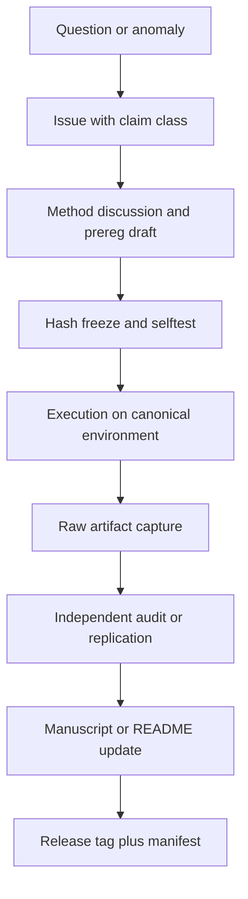
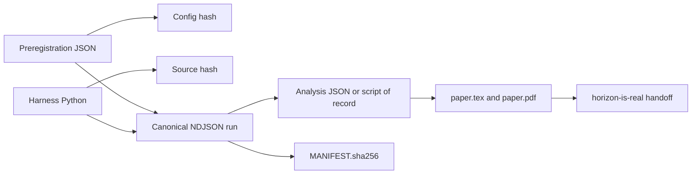
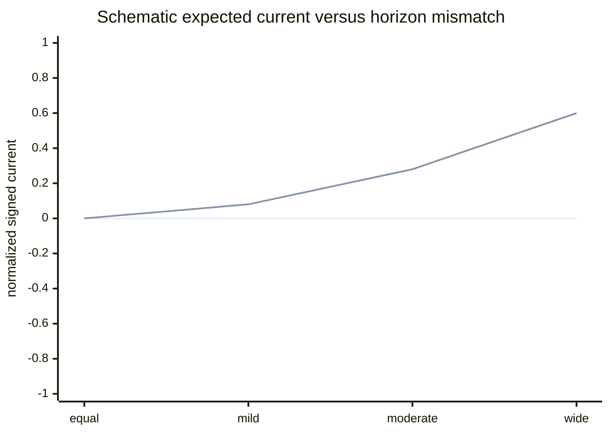
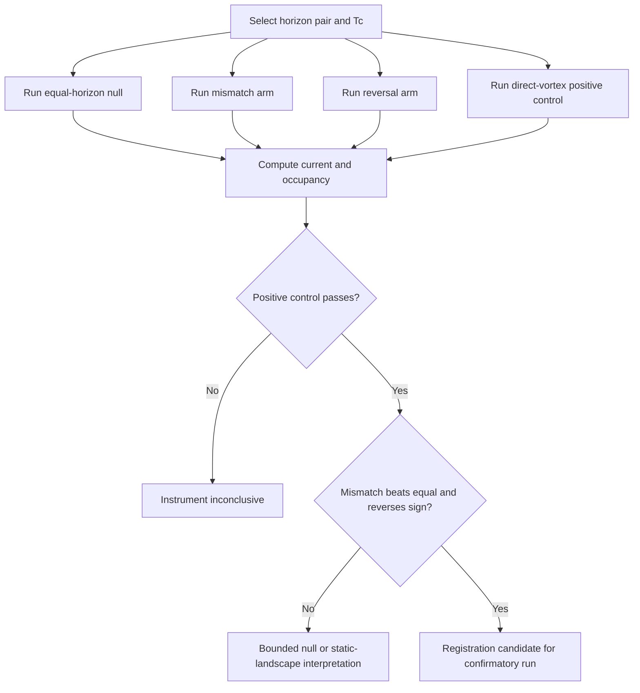

# Paper Draft and Collaboration Plan for Horizon Is Real

## Executive summary

The public materials support a clear and unusually disciplined core claim. The computational program behind *horizon-is-real* did **not** find a sustained entropic “motor” in the tested overdamped regime, but it **did** find that the planning horizon parameter, \(\tau\), reliably reorganizes the system’s resting distribution. In the project’s own language, “the horizon is real, the motor is not.” The philosophical repository is explicitly framed as the handoff that begins where the computational repository *entropy-as-tunable-equilibrium* stops, and it anchors its claims to the v4 manuscript and to the reproducible artifacts from the v4 line. citeturn21view1turn1view0turn3view0

The strongest journal-ready framing is therefore **not** “entropy drives reality” and not “simulation theory is experimentally supported.” It is a narrower, stronger, and more defensible thesis: in this implementation class, causal-entropic forcing behaves as a **horizon-tunable equilibrium selector** rather than as a persistent nonequilibrium engine. The empirical arc that makes this claim credible is the sequence from v3 through v4.3: a real \(\tau\)-dial in kinetics and occupancy, an apparent v4.1 kinetic effect, an audit that exposed a malformed gate and pseudo-replication risk, a matched-estimator v4.2 design that dissolved the effect into estimator roughness, and a v4.3 non-conservative extension that still failed to yield detectable circulation above the instrument’s floor. citeturn23view0turn4view1turn4view6turn4view8turn5view0turn5view1

For publication, the recommended stance is an interdisciplinary paper centered on **methodological honesty and physical interpretation**: a pre-registered search for an entropy-driven engine that instead discovered a horizon-dependent equilibrium structure, along with a reproducibility architecture strong enough to overturn its own earlier positive. That combination is the project’s genuine novelty. The philosophical bridge to simulation-theoretic or metaphysical language can be included, but only as a carefully labeled interpretive layer rather than an evidential conclusion. *horizon-is-real* itself insists on that discipline: the horizon “structures; it does not push,” and any mind or simulation analogy is licensed as a question, not established as a result. citeturn21view1turn21view0

A good collaboration plan should therefore optimize for three things at once: first, cleaner public reproducibility around the v4 artifacts and manuscript; second, explicit separation between **established findings** and **philosophical wagers**; and third, a next-step v4.4 program aimed at the one honest remaining gap: whether a broader anisotropic-horizon sweep or a closed no-reset protocol can reveal a true nonequilibrium current where the single-split v4.3 test did not. The public paper already states that the v4.3 bound is not a proof of absence and names horizon sweeps and closed-stationary current measurements as natural next targets. citeturn5view0turn5view1turn28view1

## Research basis and framing

The project really consists of two linked repositories with distinct functions. The computational repository, *entropy-as-tunable-equilibrium*, contains the simulation code, results summaries, figures, specifications, and the v4 provenance record. Its README states the main result as a falsifiable experiment that began by asking whether entropy can “drive a system” or only “describe one,” and concludes that the horizon knob reorganizes the system while the engine claim fails in the tested regime. The philosophical repository, *horizon-is-real*, states that it begins “where entropy-as-tunable-equilibrium hands off,” and carries the conceptual interpretation forward under strict honesty constraints. citeturn6view0turn21view1

The original technical starting point is Wissner-Gross and Freer’s causal-entropic force, \(F = T_c \nabla S_c\), where \(S_c\) is a horizon-limited entropy over reachable futures. Their claim was that maximizing future path diversity can produce adaptive, apparently intelligent behavior such as centering, tool use, and cooperation. The current project takes that mechanism seriously enough to test it against a sharp alternative: if the mechanism is genuinely engine-like, changing the horizon parameter should induce organization that cannot be reduced to equilibrium readout. citeturn14search0turn32search3turn9view1

The most important theoretical turn in the project is not the original proposal but the conservative-boundary result. The root repository’s Arm A showed that in the overdamped, position-only setting, the effective force behaves conservatively enough that the driven steady state is captured by an equilibrium-like analytic form, \(p_{\text{engine}} \propto \exp(\beta T_c S_c)\). The project’s own prior-art memo correctly places this within the classic separation between equilibrium structure and kinetic observables: steady-state occupancies can be blind to barriers and path lengths even when first-passage times are not. The root repo’s Arm C failed exactly on this point, while v2 and v3 translated the problem into kinetic observables. citeturn22view1turn23view0turn10view2

That framing also aligns with mainstream non-equilibrium statistical mechanics. Broken detailed balance and sustained probability currents are among the standard signatures of nonequilibrium driving, and entropy production or current fluctuations are canonical ways to detect such driving. The project’s v4 work follows that logic directly: if a true entropic “motor” exists in the tested 2D setting, it should generate coherent circulation or other broken-detailed-balance signatures. The public v4 manuscript repeatedly uses this criterion and reports its absence across the matched-estimator conservative class and the first anisotropic-horizon extension. citeturn29search0turn16search1turn25search1turn5view0

This is also where the project’s connection to active inference becomes legitimate but bounded. Friston’s free-energy principle is framed as a theory of adaptive systems in which action, perception, and learning minimize free energy, while later active-inference work makes expected free energy the quantity balancing preferred outcomes with epistemic value or information gain. That family resemblance matters because the project’s empirical “horizon” resembles a planning depth or anticipatory constraint. But the project should avoid collapsing these literatures into one another. Active inference is a normative and inferential architecture; the causal-entropic simulations here are a tested dynamical construction whose most defensible result is about conservative versus nonequilibrium structure. citeturn31view2turn31view0turn31view1

The philosophical bridge to simulation theory is even more delicate. Bostrom’s classic argument is a trilemma about posthuman civilizations, ancestor simulations, and the probability that observers like us are simulated. Chalmers, by contrast, treats the Matrix hypothesis as a metaphysical rather than skeptical hypothesis, arguing that a computationally constituted world could still be real in an ordinary sense. Those sources can help explain why “substrate,” “horizon,” and “constructed reality” are philosophically resonant here. But nothing in the public computational record demonstrates that the physical world is computational in Chalmers’s sense or simulated in Bostrom’s sense. At most, the project offers a disciplined empirical metaphor: future-access structure can reorganize present equilibria without introducing a motor. citeturn30view0turn30view1turn30view2

A useful way to present this boundary is the following:

| Layer | Strongest defensible claim |
|---|---|
| Public computational result | In the tested overdamped regime, the horizon parameter changes equilibrium structure, but no sustained engine current survives audit and matched-estimator control. citeturn23view0turn5view1 |
| Physical interpretation | The tested scalar-gradient class behaves like a tunable effective potential, and the first minimal non-conservative extension remained below detection at the tested split. citeturn5view0turn4view8 |
| Philosophical extension | “The horizon is real” can be explored as a metaphysical structuring principle, but this goes beyond what the instrument by itself establishes. citeturn21view1turn21view0 |
| Simulation-theory contact | A useful analogy or discourse partner, not an empirical conclusion of the experiments. citeturn30view0turn30view2 |

## Paper draft

### Abstract

Causal-entropic forcing proposes that systems can be driven by gradients of future path entropy rather than by externally imposed reward. The public research program underlying *horizon-is-real* and *entropy-as-tunable-equilibrium* was built to test that claim in a falsifiable way by turning a single knob: the planning horizon \(\tau\). Across Phase 0, Arms A–C, v2, v3, and the v4.1–v4.3 campaign arc, the program found a stable two-part result. First, the horizon knob is empirically real: changing \(\tau\) reorganizes occupancy and first-passage behavior. Second, in the overdamped regime studied here, this organization does not manifest as a sustained entropic motor. Instead, the public record converges on a conservative or effectively conservative interpretation in which \(\tau\) reshapes an equilibrium landscape. v4.1 initially suggested a short-horizon kinetic separation between online and frozen estimators, but a block-level audit and a redesigned matched-estimator v4.2 campaign dissolved that effect into finite-sample estimator roughness. v4.3 then tested a minimal anisotropic-horizon extension with nonzero curl by construction; despite a repaired and validated positive control, the extension produced no detectable circulation above the instrument’s floor at the tested split. The result is therefore not “entropy as engine,” but “entropy as tunable equilibrium”: structure without a motor. This paper argues that the project’s main contribution is methodological and conceptual together: a pre-registered program whose strongest discovery emerged from the survival of a null under adversarial correction, and whose philosophical extension must remain explicitly downstream of that computational boundary. citeturn21view1turn23view0turn4view6turn4view8turn5view1

### Introduction

The causal-entropic-force proposal of Wissner-Gross and Freer gave quantitative form to a striking idea: a system that locally prefers states with more diverse reachable futures can display adaptive, apparently intelligent behavior without external reward shaping. The present project began by taking that proposal literally and asking whether entropy in this setting is acting as a **driver** or as a **description**. The initial design logic was elegant: ordinary thermal relaxation has no horizon knob, whereas a causal-entropic model does. If varying \(\tau\) alone reorganizes the system, then entropy would appear to be doing dynamical work. citeturn14search0turn32search3turn23view0

What emerged was more subtle. The horizon knob undeniably matters. In Phase 0 and Arm B, changing \(\tau\) shifted mass toward option-rich regions while the control remained fixed. Yet the make-or-break static discriminator in Arm C failed: the expected \(\tau^* \propto L_{\mathrm{channel}}^2/D\) signature did not materialize in occupancy, even though a D-scan showed a clean inverse-\(D\) law. The failure was not noise but diagnosis: the steady-state observable was blind to the kinetic path quantity it was meant to detect. That failure forced the program toward first-passage observables and eventually toward the central claim of the project: horizon structure can be real while an entropic engine is absent. citeturn22view1turn23view0turn23view1

The v4 line made the physical stakes explicit. If the scalar-gradient implementation class is conservative, then the only route to a genuine motor is to break that class. The v4 manuscript shows that the project followed this logic with unusual methodological severity: preregistration, hash-anchored configurations, deterministic seeding, external-seat replication, analysis-of-record scripts, and a willingness to correct published interpretations when gates proved malformed or underpowered. In that sense, this project is not merely about entropy; it is also a case study in how a negative result can become stronger as the experimental architecture becomes more adversarial. citeturn11view0turn3view0turn27view0

### Related work

The most direct antecedent is causal-entropic forcing itself. Wissner-Gross and Freer proposed a force based on future path entropy and argued that it can generate behaviors associated with intelligence. Subsequent critical commentary questioned whether the force vanishes under certain formulations or whether the basic relations had earlier thermodynamic analogues. The present project should cite both the original formulation and these early critiques, because the paper’s credibility improves when it acknowledges that the “engine” interpretation has been contested from the start. citeturn14search0turn32search0turn32search1

A second cluster is the intrinsic-motivation literature. The project’s own prior-art note is right to connect causal-entropic forcing to reward shaping, maximum occupancy, and empowerment. Ng, Harada, and Russell established the classical logic of potential-based shaping, while newer work formally interprets potential shaping as a gradient on an MDP graph. Ramírez-Ruiz and colleagues’ Maximum Occupancy Principle is especially important, because it elevates future path occupancy into a reward-free account of apparently purposive behavior and explicitly treats rewards as means rather than ends. This literature gives the paper a strong interdiscipline bridge between statistical physics and control/inference theory. citeturn17search0turn17search1turn26search0turn26search2

A third cluster is active inference. Friston’s free-energy principle casts adaptive systems in terms of free-energy minimization, while later active-inference work shows that expected free energy combines preferred outcomes with epistemic value or information gain. This is relevant not because the present simulations *are* active inference, but because the project’s horizon variable naturally invites comparison with planning depth, epistemic exploration, and model-based anticipation. The paper should treat this parallel as comparative framing rather than identity. citeturn31view2turn31view1

A fourth cluster is nonequilibrium physics. Visser’s analysis of conservative entropic forces is directly relevant because it shows that entropic reinterpretations of conservative dynamics face strong structural constraints. Seifert’s stochastic thermodynamics, Battle’s broken-detailed-balance work, and current-fluctuation approaches to dissipation all supply the language needed to distinguish equilibrium-like organization from a true motor. The paper should explicitly state that the v4 program’s defining criterion for “engine” status is not unusual or idiosyncratic: it is the standard expectation that sustained nonequilibrium organization should break detailed balance and support observable currents or entropy production. citeturn24view7turn16search1turn29search0turn25search1

Finally, for the philosophical repository, there is a legitimate but non-evidential conversation with simulation-theory and metaphysical-computational literature. Bostrom’s simulation argument and Chalmers’s Matrix metaphysics are useful as conceptual neighbors because they reframe “what reality is made of” in computational or post-biological terms. They should appear, if at all, in a short final subsection or discussion paragraph that marks them as speculative analogies. They are not prior empirical art for the simulations themselves. citeturn30view0turn30view2

### Methods

The public v4 manuscript defines the core physical system as an overdamped Langevin particle in a two-chamber 2D box with a channel through a central wall, simulated with Euler–Maruyama integration under reflecting boundaries. The causal-path entropy field \(S_c(\mathbf r,\tau)\) is estimated from coarse-grained endpoint distributions of free-diffusion rollouts over horizon \(\tau\), and the force is computed by finite differences using common random numbers across evaluation points. The crucial methodological distinction is between “frozen” and “online” estimators: the frozen arm precomputes a grid-based scalar field and is conservative by construction, while the online arm re-estimates the gradient during dynamics, introducing estimator fluctuation. citeturn3view0turn22view1

The broader computational repository supplies the earlier phases and the simpler reproduction commands. Phase 0 uses a 1D dumbbell landscape to verify horizon-dependent migration away from the narrow deep well and toward the wide shallow well; Arm A tests the conservative steady-state shortcut; Arm B probes 2D chamber crossover; Arm C tests channel-length scaling. Public quick-start commands are already available for these stages, which is important for interdisciplinary review because it lowers the barrier to reproduction. citeturn22view0

The v4 line then raises the standard of methodological control. v4.1 used powered short-horizon conditions and initially reported an online-versus-frozen first-passage difference, but the occupancy gate was later shown to compare a distance statistic to \(\alpha\) as if the distance were a \(p\)-value. v4.2 repaired this by moving to block-level permutation inference with Holm correction, requiring an occupancy gate demonstrably capable of failing, matching frozen and online arms at equal rollout count \(M\), and introducing a direct-vortex positive control. v4.3 repaired the underpowered control from v4.2, gated the run on the control’s own simulated compound power, and tested the anisotropic-horizon field \(F = (T_c \partial_x S_c(\tau_x), T_c \partial_y S_c(\tau_y))\), whose curl is nonzero by construction when \(\tau_x \neq \tau_y\). citeturn3view0turn4view4turn4view6turn4view8turn28view1

The reproducibility architecture is itself part of the method. Configuration hashes and source hashes are first-class identifiers; canonical runs are stored as NDJSON with version and hash stamps; deterministic seeding derives from SHA-256 of unit identifiers; and replication contracts require byte-level verification before execution. That structure is not incidental. It is one of the paper’s strongest methodological contributions and should be described as such. citeturn11view0turn27view0turn5view2

### Results

The pre-v4 arc establishes the project’s empirical backbone. Phase 0 reproduced horizon-dependent migration in a 1D dumbbell, with mass in the option-rich basin rising from about 0.483 to 0.668 while the control remained fixed near 0.527. Arm A then passed the conservativeness check with KL\((p_{\text{driven}}\|p_{\text{analytic}})=0.0002\) and overlap 0.993, licensing the analytic shortcut for later steady-state work. Arm B showed strong monotone reorganization in the 2D chamber system, with engine \(P_L(\tau)\) rising from 0.511 to 0.910 against a fixed control at 0.371. Arm C falsified the registered channel-length prediction: \(\tau^*\) was flat in channel length, with a through-origin \(R^2=-17.7\), while a D-scan showed \(\tau^* \propto 1/D\) with \(R^2 \approx 0.97\). citeturn22view1turn23view0turn23view1

The kinetic pivot followed naturally. The root repository summarizes v2 as confirming that first-passage observables recover the corridor signature that occupancy misses, with MFPT \(\propto \mathrm{sep}^2/D\) and \(R^2=0.992\), while the conservative engine continues to show near-zero current. v3 then asked the sharper question: does the \(\tau\)-dial leave a kinetic fingerprint that no static \(U\) can mimic? The answer, as publicly summarized, was an “honest negative”: the \(\tau\)-dial is real, shifting MFPT from 13.9 to 6.1, but in 1D it is just equilibrium relaxation in a \(\tau\)-dependent effective potential \(U_{\mathrm{eff}}(\tau)=-T_cS_c\); the driven scaling was close to drift-like \(\alpha \approx 1\), not diffusive \(\alpha=2\), and current remained essentially zero. citeturn23view0

Within v4 itself, the key public result is the *arc*, not any single campaign. v4.1 produced an apparent short-horizon first-passage difference between online and frozen implementations. Yet the corrected reanalysis showed that while the kinetic effect survived block-level testing at the powered horizons, the occupancy match did not. The remaining occupancy difference was statistically real but physically small, on the order of a few percent of redistributed probability mass, which made interpretation ambiguous. citeturn4view1turn4view2turn4view3

v4.2 resolved that ambiguity. When the frozen and online arms were matched on rollout count \(M\), the first-passage effect vanished, and the \(M\)-sweep showed that the apparent v4.1 separation scaled with estimator roughness. The manuscript states the main matched-\(M\) result bluntly: the arms are indistinguishable in first-passage kinetics, with \(p=0.47\) and Hedges’ \(g=-0.32\), while the roughness relation showed slope \(+0.63\) against \(\log(1/M)\) with \(p=5\times10^{-4}\). The conclusion is not simply “null”; it is “mechanism identified.” citeturn3view0turn4view6

v4.3 then repaired the one control that had been too weak in v4.2 and used that repaired instrument to test the anisotropic-horizon engine directly. The direct-vortex positive control passed decisively at longer unit length and 32 blocks per arm. With the instrument thus proven, the anisotropic-horizon engine still produced no detectable circulation above the registered floor at the tested horizon split, and the paper emphasizes that the bound lies more than sevenfold below the smallest signal the instrument could clearly resolve in the control. The manuscript therefore arrives at a bounded null rather than a sweeping impossibility result: no engine current was detected in the tested anisotropic setting, but the floor was set by compute, not by a closed theory of all such extensions. citeturn4view8turn4view9turn5view0turn5view1

### Discussion

The paper’s discussion should be built around one sentence: **the project discovered a real horizon-structuring effect without discovering a motor**. That sentence is stronger than it may look. It means the work avoids both naïve triumphalism and dismissive nullism. It did not show that entropy “does nothing.” It showed that in a carefully specified and repeatedly audited setting, the empirical signature of entropy was reorganization of equilibrium structure rather than sustained nonequilibrium driving. citeturn21view1turn5view1

That result has three layers of significance. At the physical layer, it clarifies a conservative-by-construction boundary: a scalar path-entropy gradient can reorganize occupancy and kinetics without generating circulation. At the methodological layer, it demonstrates the value of preregistration, hash-anchored artifacts, and adversarial replication: the paper became more credible precisely because a positive headline failed to survive the instrument built to check it. At the conceptual layer, it isolates the kernel that philosophy is allowed to inherit: not “entropy drives reality,” but “future-access structure can change what equilibrium looks like.” citeturn5view0turn11view0turn21view0

The paper should also be explicit about alternative explanations and limitations. The public manuscript already names the most important ones. One is estimator noise: v4.1 taught that online-versus-frozen differences can be generated by finite-sample roughness rather than by genuine dynamics. Another is the static-landscape alternative: once the scalar-gradient class is conservative, a \(\tau\)-shaped effective potential explains the observations without requiring a motor. Still another is protocol scope: occupancy and current were measured in a reset-based transport protocol rather than in a closed stationary nonequilibrium steady state. The paper openly states that a bound in this protocol is not the same as proving absence in a closed NESS. citeturn4view6turn5view0turn28view1

Finally, the discussion should describe the philosophical extension as disciplined rather than expansive. Bostrom and Chalmers can appear in the paper only as context for why a “horizon” result matters to broader metaphysical questions. Those questions are real, but the project’s own handoff document is right: the computation can say “no motor above this floor, in this world we constructed,” but it cannot say “nature runs no motor.” That sentence should become the ethical hinge of the paper’s interpretation section. citeturn21view0turn30view0turn30view2

### Conclusion

A submission-ready formulation of the conclusion is as follows:

> The public record of this program supports a two-part conclusion. First, the horizon parameter \(\tau\) is a genuine structuring variable: changing it reorganizes both stationary occupancy and first-passage behavior. Second, in the overdamped implementation class examined here, that reorganization is best interpreted as relaxation into a \(\tau\)-tunable effective equilibrium, not as evidence for a persistent entropy-driven motor. The major positive of v4.1 dissolved under matched-estimator control in v4.2, and the first minimal non-conservative extension in v4.3 remained below the instrument’s current-detection floor despite a validated positive control. The result is therefore a bounded negative with a positive conceptual core: structure without a motor. The paper’s main contribution lies not only in the physics of that result but in the reproducibility regime that made it possible for the program to correct itself in public. citeturn5view1turn21view1

### Suggested figures and tables

The manuscript should include the following figures and tables, all of which are supported by the public artifacts or by straightforward derivative analysis:

| Type | Proposed item | Purpose |
|---|---|---|
| Figure | Phase 0 1D horizon overlay | Show the original horizon migration effect. citeturn22view1 |
| Figure | Arm B crossover \(P_L(\tau)\) versus control | Show the core “horizon knob is real” result. citeturn22view1 |
| Figure | Arm C \(\tau^*\) versus \(L_{\mathrm{ch}}^2/D\) and D-scan | Show falsification and diagnosis in one visual. citeturn23view1 |
| Figure | v4.1 corrected survival curves and occupancy inset | Show apparent kinetic separation plus occupancy confound. citeturn4view3 |
| Figure | v4.2 matched-\(M\) dissolution and roughness slope | Show mechanism identification. citeturn3view0turn4view6 |
| Figure | v4.3 positive control versus anisotropic-horizon null | Show “instrument proven, engine absent above floor.” citeturn4view8turn5view1 |
| Table | Campaign summary from v3 through v4.3 | Give reviewers a one-page arc view. citeturn23view0turn5view1 |
| Table | Reproducibility anchors and hashes | Surface the project’s strongest practical asset. citeturn11view0turn5view2 |

## Reproducibility appendix

The strongest public reproducibility assets already in the repositories are the explicit file hierarchy, the first-class hash anchors, the NDJSON canonical runs, and the fact that the computational and philosophical repos are linked rather than blended. The computational repo exposes root-level code and results directories as well as a dedicated `v4` provenance directory; the philosophical repo exposes the handoff note and the LaTeX manuscript. citeturn6view0turn1view0

### Exact repo files to cite

| File or directory | Why it matters |
|---|---|
| `README.md` in `entropy-as-tunable-equilibrium` | Public thesis statement, quick-start commands, summary of Phase 0 through v4. citeturn6view0turn22view0 |
| `RESULTS.md` | Root experimental outputs for Phase 0 and Arms A–C, including quantitative failure analysis of Arm C. citeturn22view1 |
| `SPEC.md` | Original preregistered logic of the horizon-knob experiment. citeturn9view1 |
| `docs/PRIOR_ART_AND_NOVELTY.md` | Honest novelty accounting and related-work framing. citeturn9view2turn10view3 |
| `v4/README.md` | Public hash-anchored provenance for v4.1–v4.2, including manifest verification guidance. citeturn11view0 |
| `v4/prereg_v41.json` | v4.1 preregistration receipt. citeturn11view0 |
| `v4/v41_harness.py` | v4.1 execution harness. citeturn11view0turn5view2 |
| `v4/v41_run.ndjson` | Canonical v4.1 run. citeturn11view0turn3view0 |
| `v4/v41_analysis.json` | Original v4.1 analysis output. citeturn11view0 |
| `v4/v41_blocklevel.py` | Corrected block-level analysis-of-record. citeturn11view0turn3view0 |
| `v4/v41_blocklevel_analysis.json` | Machine-written corrected v4.1 analysis. citeturn11view0 |
| `v4/prereg_v42.json` | v4.2 preregistration with matched-estimator design. citeturn11view0turn3view0 |
| `v4/v42_harness.py` | Corrected v4.2 harness. citeturn11view0 |
| `v4/v42_run.ndjson` | Canonical 152-unit v4.2 run with per-line stamps. citeturn11view0turn5view2 |
| `v4/v42_crossver_pin.ndjson` | Cross-version determinism check. citeturn11view0 |
| `v4/v43/prereg_v43.json` | v4.3 preregistration and gate text. citeturn12view0turn28view1 |
| `v4/v43/v43_harness.py` | v4.3 harness, hash-verified in the public replication contract. citeturn12view0turn27view0 |
| `v4/v43/v43_run.ndjson` | Canonical v4.3 run. citeturn12view0turn5view2 |
| `v4/v43/v43_analysis.json` | v4.3 analysis artifact. citeturn12view0 |
| `v4/v43/MANIFEST.sha256` | Byte-level artifact verification. citeturn12view0turn5view2 |
| `v4/v43/REPLICATION_CONTRACT_V43.md` | Publicly visible per-unit commands and audit logic for partial replication. citeturn27view0 |
| `horizon-is-real/README.md` | Public philosophical handoff statement and honesty rails. citeturn21view1 |
| `horizon-is-real/HANDOFF_computational_to_philosophical.md` | Boundary statement between computational conclusion and philosophical inheritance. citeturn21view0 |
| `horizon-is-real/docs/paper.tex` | The v4 manuscript itself. citeturn3view0turn5view2 |

### Data formats

The project uses a reproducibility stack that is easy to document and worth preserving. Public materials indicate:

- **NDJSON** for canonical runs, with one JSON object per unit and stamps for versioning, NumPy, config hash, and source hash. citeturn11view0turn5view2
- **JSON** for preregistrations and machine-written analyzer outputs. Hashes are computed from canonical sorted-key JSON serialization. citeturn11view0turn5view2
- **SHA-256 manifest files** for bulk verification of artifacts. citeturn11view0turn12view0
- **LaTeX and PDF** for the manuscript layer. citeturn1view0turn21view1
- **PNG/PDF figures** in the figures directory and manuscript figure references. citeturn6view0turn22view1

### Publicly visible hashes and identity anchors

The following anchors are explicitly visible in the public materials:

| Campaign | Public anchors |
|---|---|
| v4.0 | prereg hash `2f8a9e985010c1f6`. citeturn3view0turn5view2 |
| v4.1 | prereg hash `c439a2ba2eb1c1bd`; `v41_blocklevel.py` SHA-256 prefix `29153b802197f88a`; `v41_run.ndjson` SHA-256 prefix `6d78de71f05e042d`; `v41_harness.py` SHA-256 prefix `655dc7d55b908eac`. citeturn3view0 |
| v4.2 | config hash `35e4ad5430ac4ff7`; source hash `cf96923bba3e941c`; `v42_run.ndjson` SHA-256 `3139ceb11c5c6572…`; `v42_crossver_pin.ndjson` SHA-256 `1d93c3f675aa0754…`. citeturn11view0turn5view2 |
| v4.3 | config hash `4e4b68d562b76f8a`; prereg short hash `3c43fdfe`; `v43_run.ndjson` SHA-256 `21eeed5a65189c73`; `v43_harness.py` SHA-256 prefix `1b950383ae012431`; public commit anchor `0424825`. citeturn5view2turn27view0 |

### Commands to reproduce

The public repositories already expose enough commands for a strong appendix, though not yet enough for a one-command full-paper replay. A transparent appendix should list only commands actually visible in the public materials and flag the missing ones.

```bash
# Root repository quick start
pip install -r requirements.txt
python -m src.phase0_validated_1d
python -m src.run --arm A
python -m src.run --arm B
python -m src.run --arm C
python -m src.run_fast --arm B
python -m src.run_fast --arm C
python -m src.diagnostics --scan D
```

These commands are all publicly visible in the root repo’s quick-start or results file. citeturn22view0turn23view1

```bash
# v4 provenance verification
cd v4
shasum -a 256 -c MANIFEST.sha256
python3 v42_harness.py --plan
```

These are publicly visible in the `v4` README. citeturn11view0

```bash
# Publicly visible v4.3 contract commands for partial deterministic replication
python v43_harness.py --unit C4v_frozen_k8.0_tau1.0_sb0
python v43_harness.py --unit C5a_frozen_tx0.25_ty1.0_sb0
python v43_harness.py --unit C5a_frozen_tx1.0_ty1.0_sb0
```

The public replication contract exposes these as per-unit commands and gives the verified harness SHA requirement beforehand. citeturn27view0

The appendix should then add one honest note: **a single-command end-to-end replay target for v4.3 was not visible in the public materials reviewed here**. That should be fixed before submission by adding a small `Makefile` or `justfile` with targets such as `reproduce-phase0`, `reproduce-armABC`, `reproduce-v42`, and `reproduce-v43`.

## Collaboration plan

The repositories are scientifically interesting because they already contain infrastructure that many small research projects lack: preregistration, canonical artifacts, manifests, deterministic seeding, and explicit replication contracts. What they still need is a cleaner collaboration surface so that outside contributors can help without diluting the project’s epistemic discipline. The public computational repo currently shows no open issues or pull requests, so the collaboration plan should begin by turning the existing architecture into explicit contributor pathways rather than assuming people will infer them from the files alone. citeturn6view0

### Proposed contribution model

The recommended governance model is **lead-researcher final arbitration, open methods review, receipt-first merging**. In practice:

1. The lead researcher owns final scientific claims, preregistration freeze points, and manuscript signoff.
2. Contributors can propose code, tests, analyses, or prose, but all result-bearing changes must link to a manifest, prereg, or script of record.
3. Philosophy-facing contributions belong in *horizon-is-real*; simulation code, analyses, and campaign receipts belong in *entropy-as-tunable-equilibrium*.
4. Any change that affects numerical results should require an updated reproducibility receipt or an explicit statement that canonical outputs are unchanged.

That model is already implicit in the public handoff language and in the v4 replication contracts. citeturn21view1turn27view0

### Workflow diagram

The current project logic is best preserved if contributions move through a receipt-oriented path like this:



This diagram reflects the public v4 pattern of preregistration before execution, hash verification before runs, and post-run audit against raw artifacts. citeturn11view0turn27view0

### Entity-relationship diagram



### Priority issues to open

| Proposed issue | Why it should be first |
|---|---|
| Synchronize manuscript top matter with current campaign arc | `paper.tex` front matter still references “v4.0–v4.2” even though the abstract and conclusion discuss v4.3 and the dedicated occupancy follow-up. citeturn3view0turn5view1 |
| Add a root `REPRODUCE.md` | Public commands exist but are scattered across README, RESULTS, v4 README, and contracts. citeturn22view0turn11view0turn27view0 |
| Add `CONTRIBUTING.md` with claim classes | Distinguish “established result,” “analysis aid,” and “philosophical speculation,” consistent with the handoff rails. citeturn21view1 |
| Add `Makefile` or `justfile` | Provide one-command recipes for Phase 0, Arm A–C, v4.2 verification, and v4.3 contract subsets. |
| Standardize artifact metadata schema | The NDJSON stamping pattern is a strength; document it formally. citeturn11view0turn5view2 |
| Add `CITATION.cff` and DOI release flow | This will make journal submission and software citation cleaner; Zenodo is an obvious match because it assigns DOIs to published artifacts. citeturn19search6 |
| Split philosophy and computation cross-links more explicitly | A bidirectional “read this next” map would help reviewers understand repo boundaries. citeturn21view1 |
| Publish a v4 campaign summary table in markdown | The paper has the arc; the repo should have a one-page public campaign matrix. |

### Tests to add

The project’s existing selftest culture is one of its best assets. The next layer should focus on hardening reproducibility:

| Test class | Proposal |
|---|---|
| Determinism tests | Verify fixed-unit outputs are unchanged on the pinned NumPy version, and numerically within tolerance on the latest supported version. |
| Manifest tests | CI should fail if `MANIFEST.sha256` is stale relative to tracked artifacts. |
| Gate-can-fail tests | Preserve the v4 lesson: every registered gate should be exercised on synthetic null data and synthetic positive data. |
| Pseudo-replication tests | Add analysis guards that refuse pooled-observation inference when block labels are present. |
| Prose/config agreement tests | Generalize the v4.4-style grep-check idea into all prereg files and outcome maps. |
| Scope tests | Enforce protocol labels such as “reset transport” versus “closed stationary” so manuscript language cannot outrun protocol scope. |

### Code review checklist

A worthwhile code-review checklist should be short enough to use every time:

| Review question | Merge requirement |
|---|---|
| Does this change alter a canonical numerical result? | If yes, update artifact receipts and explain why. |
| Is the claim type clearly labeled? | Must distinguish result, analysis aid, hypothesis, speculation. |
| Is every threshold defined in config and mirrored in prose? | Must match. |
| Can every gate fail on null data and pass on true signal in selftests? | Must demonstrate yes. |
| Are true independent units respected? | Must avoid pooled pseudo-replication. |
| Are hashes or manifests impacted? | Must refresh and document. |
| Does the PR cross the repo boundary? | If philosophy-only, it should not silently modify computational receipts. |

### CI suggestions

A lightweight but rigorous GitHub Actions setup would be enough. Suggested jobs:

- `lint-doc-links`: verify internal file references in README, RESULTS, handoff, and manuscript.
- `hash-check`: recompute `MANIFEST.sha256` and fail on mismatch.
- `selftest-pinned`: run all harness selftests on pinned Python/NumPy.
- `smoke-root`: run Phase 0 and Arm A minimal smokes.
- `crossver-tolerance`: run a small deterministic subset on pinned NumPy and latest NumPy, compare exact or tolerance-bounded fields.
- `paper-build`: compile `paper.tex` and upload the PDF as an artifact.

### Data-sharing policy

The data-sharing policy should be simple and explicit:

1. **Canonical raw outputs**: commit or release only machine-generated NDJSON, not hand-curated summaries.
2. **Immutable receipts**: every released run must have a manifest and visible config/source hashes.
3. **Derived analysis**: store analysis JSON separately from raw NDJSON, never overwritten in place.
4. **DOI snapshots**: deposit release snapshots to Zenodo or equivalent at major manuscript versions. Zenodo’s value here is that it provides a citable DOI and preserves software and data together. citeturn19search6
5. **No hidden result channels**: prose summaries should always point back to raw artifacts or analysis scripts.

### Authorship and governance

For journal submission and public collaboration, adopt a light CRediT-style authorship policy:

- **Lead researcher**: conceptualization, methodology approval, preregistration freeze authority, final manuscript approval.
- **Computational contributors**: software, validation, formal analysis, visualization.
- **Auditors/replication seats**: validation and investigation, with explicit provenance credit.
- **Philosophical contributors**: conceptual framing and interpretation, but not retroactive reclassification of empirical results.

A small `GOVERNANCE.md` should specify that computational claims merge only when they preserve or update receipts, and philosophical claims merge only when they cite established anchors or are explicitly marked as speculation. That is consistent with the “rails” already stated in *horizon-is-real*. citeturn21view1

### Suggested issue templates

```markdown
## Result-bearing issue
Claim class:
Linked artifact:
Linked prereg:
What would falsify this claim?
Independent unit:
Expected output files:
```

```markdown
## Methods-review issue
Affected script or harness:
Potential failure class:
- malformed gate
- underpowered control
- pseudo-replication
- prose/config mismatch
- scope overreach
Minimal reproducer:
```

```markdown
## Philosophy/interpretation issue
Established anchor:
Speculative extension:
Boundary statement:
What public artifact constrains this reading?
```

### Suggested commit messages

- `docs: sync paper front matter with v4.3 campaign scope`
- `repro: add top-level reproduce guide for phase0 through v4.3`
- `ci: verify manifests and compile paper on push`
- `analysis: guard block-level inference against pooled pseudo-replication`
- `tests: add gate-can-fail synthetic null and positive suites`
- `governance: add CONTRIBUTING and claim-class policy`
- `release: tag interdisciplinary submission snapshot and deposit DOI`

### Proposed timeline with milestones

| Window | Milestone |
|---|---|
| Week 1 | Open repo structure issues, add `CONTRIBUTING.md`, `REPRODUCE.md`, and issue templates |
| Week 2 | Land CI, hash checks, paper build, and minimal smoke tests |
| Week 3 | Sync manuscript text with current v4.3 scope and add campaign summary table |
| Week 4 | Freeze reproducibility appendix, release a citable snapshot, and circulate pre-submission draft |
| Week 5 onward | Run or preregister next experiment set, then submit revised manuscript with updated appendix |

## Experimental roadmap

The public materials identify the honest remaining gap clearly. v4.3 established that the repaired instrument can resolve a real injected current, but the anisotropic-horizon engine remained below detection at **one tested horizon split**. The manuscript explicitly says that this is a bounded null “rather than a closed door,” and it names a horizon sweep and a closed-stationary no-reset current measurement as targets for v4.4 and beyond. That is exactly where the next experiments should go. citeturn5view0turn5view1

### Proposed v4.4 design logic

The next phase should separate three hypotheses that can otherwise blur together:

1. **Estimator-roughness artifact**: apparent currents are sampling artifacts or analyzer artifacts.
2. **Static landscape without motor**: horizon mismatch changes occupancy or effective geometry but still yields no persistent current.
3. **True non-conservative motor**: horizon mismatch generates circulation that scales with mismatch and reverses under \(\tau_x \leftrightarrow \tau_y\).

That separation is already latent in the public v4.3 preregistration, which required opposite signs under the two mismatch arms and no effect at equal horizons, while explicitly limiting scope to the reset-defined transport protocol rather than a closed-system NESS claim. citeturn28view1

### Estimator variants

| Variant | Public status | Strength | Weakness | What it should be used for next |
|---|---|---|---|---|
| Frozen scalar-gradient field | Established | Conservative baseline; easy to analyze | Cannot reveal true curl within scalar class | Null baseline and equal-horizon reference. citeturn3view0 |
| Online scalar-gradient field | Established | Tests implementation roughness | Confounds fluctuation with sampling error if unmatched | Diagnostic only after strict \(M\)-matching. citeturn3view0turn4view6 |
| Matched online versus frozen | Established | Identified v4.1 artifact mechanism | Still within conservative class | Calibration and artifact rejection. citeturn4view6 |
| Anisotropic horizon split | Established frontier | Minimal curl-generating extension | One tested split only, reset protocol only | Main v4.4 response-surface target. citeturn4view8turn5view1 |
| Direct vortex positive control | Established | Proves circulation instrument can pass | Does not prove entropic current exists | Mandatory positive control in every new engine campaign. citeturn4view8 |

### Horizon settings and expected signatures

The following table mixes public logic with proposed defaults. Publicly established signatures are cited; proposed extra cells are explicitly offered as defaults rather than public facts.

| Setting | Expected if true motor | Expected if static landscape only |
|---|---|---|
| \(\tau_x=\tau_y\) | No net circulation | No net circulation |
| Mild mismatch | Small current with sign set by arm orientation | Occupancy shift possible, current near zero |
| Moderate mismatch | Stronger current, reversible under swap | Occupancy or local asymmetry changes, current still near zero |
| Reversal \((\tau_x,\tau_y) \leftrightarrow (\tau_y,\tau_x)\) | Sign reversal is essential | No coherent antisymmetric reversal |
| Higher \(T_c\) at fixed mismatch | Larger current if drive-to-noise ratio matters | Larger occupancy distortion may appear without current |
| Closed no-reset protocol | Persistent current should survive burn-in | Reset-induced asymmetries should disappear |

The equal-horizon null, mismatch-versus-equal comparison, and opposite-sign requirement are grounded in the public v4.3 gates. The closed no-reset protocol is grounded in the paper’s own stated future target. citeturn28view1turn5view0

### Recommended parameter sweep

A sensible v4.4 first pass is a response surface rather than another single-point bet. Reasonable defaults, offered here as proposals rather than frozen public values, are:

- Equal-horizon null: \((0.25,0.25)\), \((1.0,1.0)\)
- Canonical reversal pair: \((0.25,1.0)\), \((1.0,0.25)\)
- Wider mismatch pair: \((0.1,2.0)\), \((2.0,0.1)\)
- Intermediate mismatch pair: \((0.25,2.0)\), \((2.0,0.25)\)
- \(T_c\) sweep at fixed widest mismatch: \(T_c = 1,2,4\)

This design directly separates horizon mismatch from amplitude scaling. It also makes the public v4.3 sign-reversal logic more testable as a response surface rather than as a single-clause gate. The public manuscript’s conclusion that the v4.3 bound was compute-set rather than theory-set is the reason this broader sweep is justified. citeturn5view1turn28view1

### Positive controls and reversal tests

The next campaign should preregister four required conditions:

1. **Direct-vortex positive control** in the same run bundle.
2. **Equal-horizon null arms**.
3. **Reversal pair** with opposite expected signs.
4. **Closed no-reset companion measurement** on the same top candidate cell.

This prevents a repeat of the v4.2 underpowered-control problem and makes it impossible to confuse reset-induced or estimator-induced asymmetries with genuine current. The public v4.3 text already treated the repaired positive control as a design lesson in itself. citeturn4view8turn27view0

### Power and sample-size calculations

Public materials do not expose all of the variance figures needed for a complete formal power analysis of a v4.4 scout. The estimates below are therefore **planning calculations**, not public results. They assume block-level standard deviations on the order of \(4.5\times 10^{-5}\) to \(5.9\times 10^{-5}\) for current statistics, which is consistent with internal v4.3-style reference values used for planning; a one-sided \(\alpha=0.01\) test is assumed when the sign prediction is preregistered.

Under those assumptions:

| Mean current to detect | Blocks needed at 90% power if SD = \(5.86\times 10^{-5}\) | Blocks needed at 90% power if SD = \(4.54\times 10^{-5}\) | Interpretation |
|---|---:|---:|---|
| \(3\times 10^{-6}\) | ~5,171 | ~3,104 | Effectively inaccessible in a routine scout |
| \(3.67\times 10^{-5}\) | ~33 | ~20 | Borderline but realistic for a confirmatory run |
| \(1.10\times 10^{-4}\) | ~4 | ~3 | Easily sizeable in a scout |
| \(2.60\times 10^{-4}\) | <1 | <1 | Positive-control scale |

These calculations strongly support a **two-stage design**. An 8-block-per-cell scout is acceptable only for **sizing large signals**. It is not adequate for ruling in or ruling out micro-currents on the order of a few \(10^{-6}\). If a scout observes only micro-scale currents, the correct conclusion is “underpowered for signal sizing,” not “no effect.” By contrast, if a cell is already above roughly \(10^{-4}\), an 8-block scout can identify it quickly as a registration candidate.

A second practical table follows from the same assumptions:

| Blocks per cell | Approximate power for \(3.67\times 10^{-5}\) signal | Approximate power for \(1.10\times 10^{-4}\) signal |
|---|---:|---:|
| 8 | ~0.29 to ~0.48 | ~0.999 |
| 16 | ~0.53 to ~0.78 | ~1.000 |
| 32 | ~0.86 to ~0.97 | ~1.000 |
| 64 | ~0.99 | ~1.000 |

The recommendation is therefore:

- **Scout**: 8 blocks per cell, response surface only, no negative gating language.
- **Registration candidate**: minimum 32 blocks for any cell that appears promising.
- **Confirmatory campaign**: 64 blocks only if the candidate signal is near the lower detectable frontier rather than the obvious-control range.

### Schematic chart of expected circulation versus horizon mismatch

The following chart is **schematic**, not empirical. It visualizes the logic of the next campaign: the null expectation stays near zero; a true motor expectation grows with mismatch magnitude and flips sign under reversal.



### Experimental workflow diagram



### Final recommendation for next experiments

The most defensible v4.4 sequence is:

1. **Publicly preregister a response-surface scout** over horizon mismatch and \(T_c\), without claiming confirmatory inference from the scout itself.
2. **Keep the direct-vortex positive control in the same bundle**, because v4.2 proved that a control that cannot pass is not a control. citeturn4view8
3. **Require equal-horizon nulls and reversal pairs** in every candidate regime, preserving the public v4.3 antisymmetry logic. citeturn28view1
4. **Promote only cells with clearly supra-floor signals** to a 32- or 64-block confirmatory run.
5. **If no response-surface cell is convincingly supra-floor, move to the closed no-reset protocol** that the public manuscript already names as the next honest scope extension. citeturn5view0

That is the route most consistent with the project’s actual strength: not boldness of claim, but disciplined narrowing of what can be said.